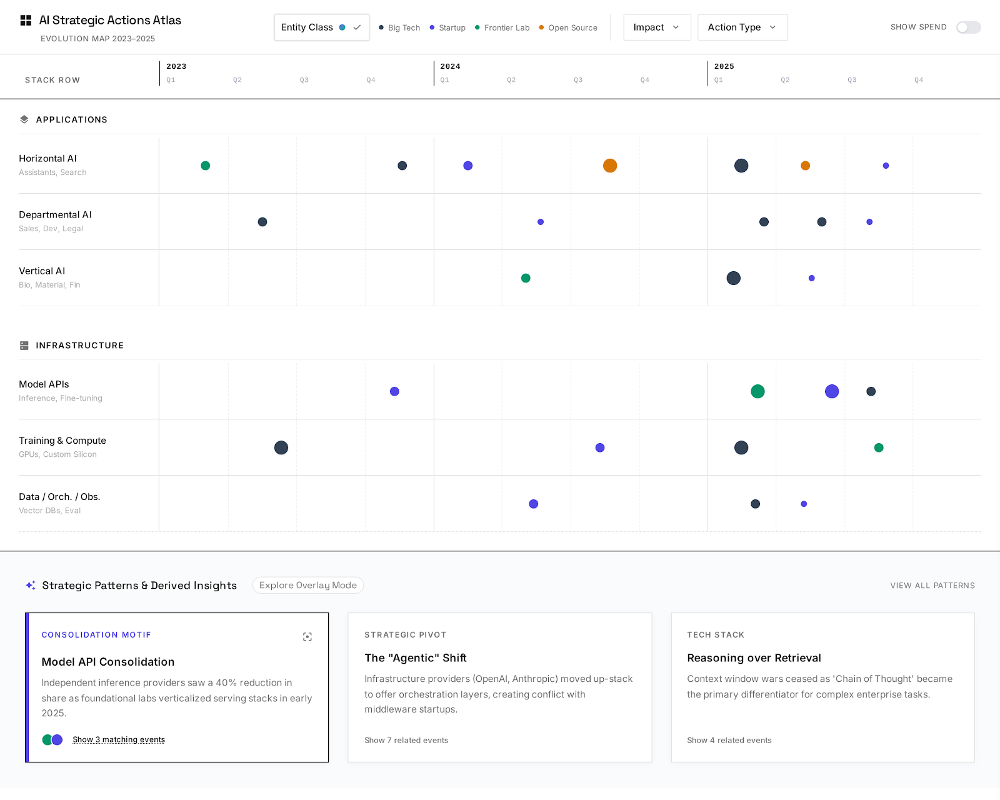

# AI Strategic Actions Atlas

A strategic intelligence platform for understanding AI ecosystem evolution across stack layers and time (2023-2025).



## Overview

This is not another market map or news aggregator. It is a system for mapping strategic actions (launches, acquisitions, investments) across a defined AI stack, deriving strategic patterns from empirical evidence, and providing time-aware context for ecosystem evolution.

**Core principle:** Stack × Time, not Company × Category.

The primary organizing axis is stack layers (vertical) by time (horizontal: 2023-2025). Companies appear as colored dots on this coordinate system. Patterns are interpretations derived from event clusters.

## Key Features

**Evidence-Based Analysis**
- 42 validated strategic events across 6 stack layers
- All events backed by credible primary sources
- Three-layer epistemic discipline: Evidence, Market Reality, Interpretation

**Strategic Pattern Recognition**
- 5 derived patterns with supporting evidence and counter-signals
- Hypothesis-driven approach (not stated as facts)
- Time-bounded analysis with confidence levels

**Interactive Timeline Visualization**
- Stack layers: Applications (Horizontal AI, Departmental AI, Vertical AI) and Infrastructure (Model APIs, Training/Compute, Data/Orchestration/Observability)
- Time range: Q1 2023 - Q4 2025 (12 quarters)
- Visual encoding: dot size (impact level), color (entity class), border style (confidence level)
- Click any event to view full details in right panel drawer
- Hover tooltips for quick event information

**Functional Filters**
- Multi-select filters: Entity Class, Impact Level, Action Type
- Dynamic event filtering with real-time grid updates
- Pattern card event counts update based on active filters
- "Clear All Filters" button to reset view

**Pattern Exploration Mode**
- Click "Show N matching events" to highlight events related to a strategic pattern
- Highlighted events scaled with red ring, non-matching events dimmed to 30%
- "Clear highlights" button to return to normal view
- Explore correlations between patterns and events visually

## Tech Stack

- **Frontend:** React + Vite + Tailwind CSS
- **Data Format:** JSONL (newline-delimited JSON) for events/patterns, JSON for canonical reference data
- **Deployment:** Static site (no backend required)

This stack provides simplicity, speed, and portability. All data is pre-generated and validated, requiring no server-side logic.

## Quick Start

### View the Application

```bash
cd app
npm install
npm run dev
```

Dev server runs at http://localhost:5174/

### Validate Data Quality

```bash
node scripts/validate_data.js
```

Expected output: All validation checks passed (42 events, 5 patterns validated)

## Project Structure

```
.
├── app/                    # React application
│   ├── src/
│   │   ├── components/    # TimelineGrid, EventDot, Tooltip, RightPanel, EventDrawer
│   │   ├── hooks/         # useData (JSONL/JSON loading)
│   │   └── App.jsx        # Root component with state management
│   └── public/data/       # Symlink to ../../data
│
├── data/                   # Golden dataset
│   ├── canonical/         # Reference data (entities, stack layers, etc.)
│   ├── events/            # 42 strategic events (JSONL)
│   └── patterns/          # 5 strategic patterns (JSONL)
│
├── docs/                   # Documentation
│   ├── PROJECT_CONTEXT.md
│   ├── REQUIREMENTS_v0.md
│   ├── DATA_MODEL_DRAFT.yaml
│   ├── EVAL_RUBRIC.md
│   └── SOURCES.md
│
└── scripts/                # Data validation
    └── validate_data.js
```

## Data Quality Framework

**Evidence Standards**
- Tier 1: Primary sources (company blogs, SEC filings, press releases)
- Tier 2: Credible secondary (NYT, WSJ, The Information, industry reports)
- Tier 3: Unverified (not used as sole evidence)

**Evaluation Rubric**
- Events scored on 5 dimensions (max 10 points, ship threshold: 7/10)
- Patterns scored on 6 dimensions (max 12 points, ship threshold: 9/12)
- All data validated before inclusion

See [docs/EVAL_RUBRIC.md](docs/EVAL_RUBRIC.md) for details.

## Epistemic Discipline

Three layers, never mixed:

| Layer | Description | Example |
|-------|-------------|---------|
| Evidence | Discrete, dated corporate actions with sources | "OpenAI launched GPT-4 in Q1 2023" |
| Market Reality | Aggregated spend, adoption data | "Model API spend reached $12.5B in 2025" |
| Interpretation | Derived patterns and motifs | "Model API consolidation reduced independent providers by 40%" |

## The Dataset

**42 Strategic Events**
- Coverage: All 6 stack layers, 4 entity classes, 2023-2025 timespan
- Evidence quality: All events have credible sources (27 high-quality, 15 acceptable)
- Key events include: GPT-4 Launch, Claude Sonnet 3.5, Cursor $200M ARR, Databricks/MosaicML acquisition

**5 Strategic Patterns**
- Model API Consolidation (Medium confidence)
- Vertical Integration into Orchestration (High confidence)
- Coding as First Killer Use Case (High confidence)
- PLG Dominates AI Applications (Medium confidence)
- Healthcare Leads Vertical AI (Medium confidence)

All patterns include hypothesis language, supporting events, counter-signals, and confidence justification.

## Current Status

**Phase 1: Complete** - Data contract, 42 events, 5 patterns, validation framework
**Phase 2.1: Complete** - Interactive UI with timeline grid, hover tooltips, and pattern cards
**Phase 2.2: Complete** - Right panel with event detail drawer, click interactions, slide-in animations
**Phase 2.3: Complete** - Functional filters (entity class, impact, action type) with multi-select dropdowns
**Phase 2.4: Complete** - Pattern overlay mode (highlight matching events, explore mode)
**Phase 2.5: In Progress** - Polish, accessibility, deployment preparation

Upcoming: Performance testing, accessibility improvements, production deployment

## Contributing

### Adding Events

1. Research event with high-quality sources
2. Add to `data/events/v0_seed_40.jsonl` (one JSON object per line)
3. Ensure all required fields per `docs/DATA_MODEL_DRAFT.yaml`
4. Run validation: `node scripts/validate_data.js`
5. Must score 7/10 or higher to ship

### Adding Patterns

1. Identify 3+ related events suggesting a trend
2. Draft hypothesis (use "suggests", "appears to", etc.)
3. Find counter-signals (epistemic honesty)
4. Add to `data/patterns/v0_seed_5.jsonl`
5. Run validation: `node scripts/validate_data.js`
6. Must score 9/12 or higher to ship

## Documentation

**Product Vision:**
- [PROJECT_CONTEXT.md](docs/PROJECT_CONTEXT.md) - Core principles and value proposition
- [REQUIREMENTS_v0.md](docs/REQUIREMENTS_v0.md) - Full MVP feature specification

**Data & Quality:**
- [DATA_MODEL_DRAFT.yaml](docs/DATA_MODEL_DRAFT.yaml) - Entity schemas and relationships
- [SOURCES.md](docs/SOURCES.md) - Evidence quality standards
- [EVAL_RUBRIC.md](docs/EVAL_RUBRIC.md) - Quality assessment framework

**Implementation:**
- [NEXT_STEPS_UI.md](docs/NEXT_STEPS_UI.md) - UI roadmap
- [PROGRESS.md](PROGRESS.md) - Implementation timeline

## Credits

**Data Sources:**
- Menlo Ventures: 2025 State of Generative AI in the Enterprise
- Company announcements and press releases
- Tech journalism (TechCrunch, The Information, Bloomberg)

**Version:** 0.1 (MVP)
**Last Updated:** 2025-12-28

## License

**Data:** Factual events are not copyrightable. All sources cited in [docs/SOURCES.md](docs/SOURCES.md)
**Code:** MIT License
